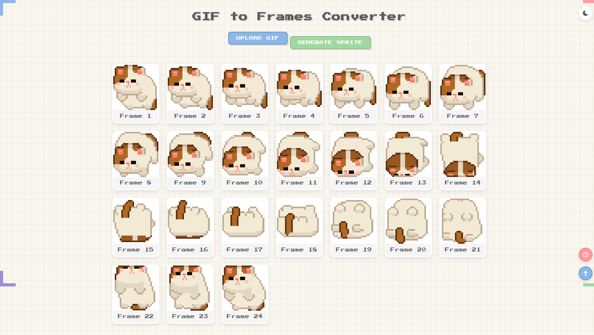

# GIF to Frames Converter

一款GIF处理工具，支持帧分解、可视化查看与雪碧图生成，采用清新像素风格设计。
（原本是为了方便临摹Gif像素画，后来发现 Aseprite 可以直接拖Gif进去😭）

## 功能特性

| 功能                | 描述                          |
|---------------------|-------------------------------|
| 🖼️ 帧级分解         | 精确提取每帧并保留原始延迟时间 |
| 🔍 智能查看器       | 支持缩放/平移/热键导航        |
| 🎨 像素探针         | Ctrl+悬停查看任意像素RGB值    |
| 🧩 雪碧图烘焙       | 一键生成横向排列精灵图        |
| 🌓 双模式主题       | 自动适配系统暗色模式          |
| 📱 触屏优化         | 完美适配移动端操作            |
| 🔒 用户隐私         | 所有处理在浏览器本地完成      |

## 📖 用户指引手册

工具内置了详细的使用手册（点击右下角帮助按钮🔍打开），包含以下内容：

### 1. **上传GIF文件**：
   - 点击"UPLOAD GIF"按钮选择文件
   - 或直接将GIF文件拖放到页面中

### 2. **查看分解结果**：
   - 工具会自动处理GIF并显示所有帧
   - 点击任意帧可放大查看

### 3. **使用放大视图**：
   - 使用左右箭头或键盘方向键浏览不同帧
   - 鼠标滚轮可缩放图像
   - 按住Ctrl键并悬停在图像上可查看像素颜色值

### 4. **生成雪碧图**：
   - 点击"GENERATE SPRITE"按钮
   - 工具会生成包含所有帧的水平排列雪碧图
   - 自动触发下载

5. **主题切换**：
   - 点击右上角的太阳/月亮图标切换亮色/暗黑模式

## 🚀 快速开始

下载压缩包后，双击html文件直接打开

## 技术细节

- 使用`libgif.js`库解析GIF文件
- 纯前端实现，无需服务器处理
- 采用现代CSS特性实现像素风格设计
- 响应式布局适配各种屏幕尺寸

## 开发与贡献

欢迎提交issue或pull request！

## 许可证
MIT